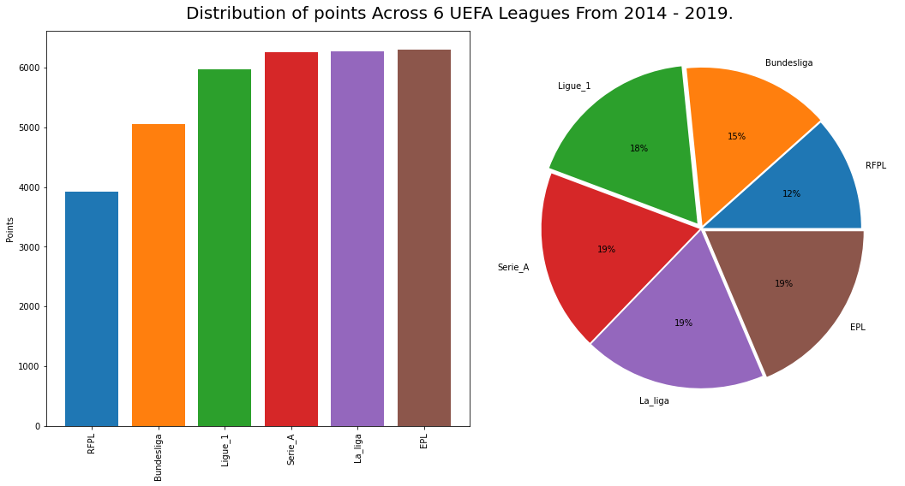
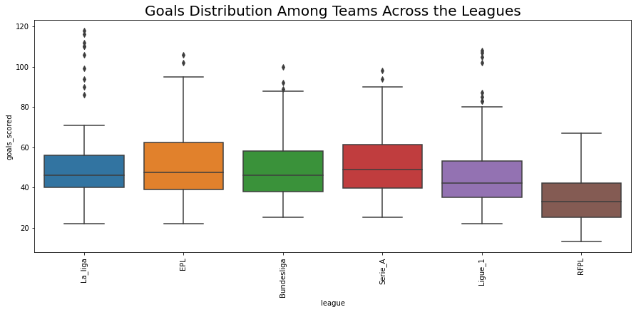
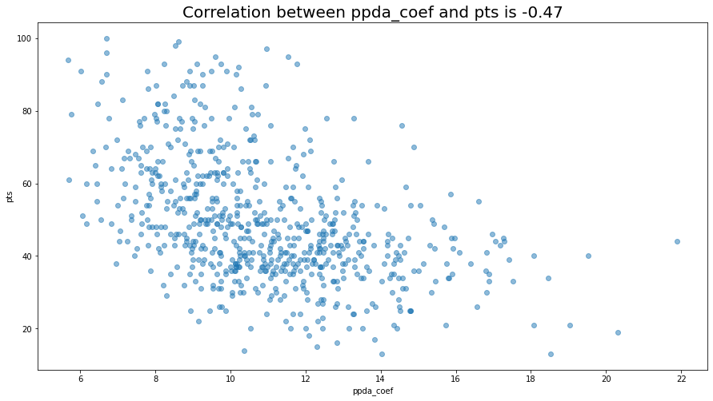

# THIS IS THE PREMIER PROJECT FOR THE MULTI - COLLINEARITY GROUP OF HDSC SUMMER 2022

## An Analysis of UEFA Leagues from 2014/2015 Season To 2019/2020 Season

## Data Summary:

The data had 684 observations for 24 features of teams in 6 leagues across Europe. These teams are part of leagues in European countries and the leagues are all members of the Union of European Football Associations (UEFA).

These observations reflected the performance of the teams across a period of 6 seasons beginning in the 2014/2015 season and ending in the 2019/2020 season.

Fortunately, there were no missing values in the dataset and so not much work was required in that aspect of the data cleaning process. Nevertheless, we had to label some unnamed columns and also change the names of certain columns to make them more descriptve of the values which they contain.

**Data Source:** [kaggle](https://www.kaggle.com/datasets/slehkyi/extended-football-stats-for-european-leagues-xg?select=understat.com.csv)

### Leagues Analyzed:

- La Liga
- EPL
- BundesLiga
- Serie A
- Ligue 1
- RFPL

### Data Features:

- __xG__ - expected goals metric, it is a statistical measure of the quality of chances created and conceded.

- __xG_diff__ - difference between actual goals scored and expected goals.

- __npxG__ - expected goals without penalties and own goals.

- __xGA__ - expected goals against.

- __xGA_diff__ - difference between actual goals missed and expected goals against.

- __npxGA__ - expected goals against without penalties and own goals.

- __npxGD__ - difference between "for" and "against" expected goals without penalties and own goals.

- __ppda_coef__ - passes allowed per defensive action in the opposition half (power of pressure)

- __oppda_coef__ - opponent passes allowed per defensive action in the opposition half (power of opponent's pressure)

- __deep__ - passes completed within an estimated 20 yards of goal (crosses excluded)

- __deep_allowed__ - opponent passes completed within an estimated 20 yards of goal (crosses excluded)

- __xpts__ - expected points

- __xpts_diff__ - difference between actual and expected points

### EDA:

It is worth noting that a higher ppda_coef implies a lower power of pressure. Some key insight from our data analysis include:

- **Insight:** The highest number of points accumulated in a single season by any team over these years is 100.

- **Insight:** The highest number of wins in a single season by a team over these years is 32 while the highest number of losses is 29.

- **Insight:** Of the 33769 points picked up in this period, the EPL, La liga and Serie A contributed an equal equivalent of 19% each.

- **Insight:** The RPFL contributed the only 4000 points (12%) of the overall sum.

- **Insight:** __Serie_A__, __La_liga__ and __EPL__ has the highest participation over the period (30 teams), followed by __Ligue_1__ (29 teams), then __RFPL__ (25 teams) and __Bundesliga__ (24 teams). 

***Question:** Could the number of teams have contributed to the number of points won?*

- **Insight:** The highest number of points recorded in a single season of __EPL__ is 100.

- **Insight:** A maximum of 38 matches are played per team per season in the __EPL__.
  
- **Insight:** Manchester City dominated the EPL over the period grabbing the highest number of points.

- **Insight:** The winning teams in __EPL__ over the period are Chelsea (2 seasons), Leicester (1 sesaon), Manchester City (2 seasons) and Liverpool (1 season).

- **Insight:** The highest number of points recorded in a single season of __La Liga__ is 94.

- **Insight:** A maximum of 38 matches are played per team per season in the __La Liga__.

- **Insight:** Barcelona has dominated the La Liga over the period grabbing the highest number of points.

- **Insight:** The winning teams in __La Liga__ over the period are Barcelona (4 seasons) and Real Madrid (2 seasons).

- **Insight:** The highest number of points recorded in a single season of __Serie A__ is 95.

- **Insight:** A maximum of 38 matches are played per team per season in the __Serie A__.

- **Insight:** Juventus has dominated the La Liga over the period grabbing the highest number of points.

- **Insight:** Juventus won all six seasons covered in this analysis.

- **Insight:** The highest number of points recorded in a single season of __Ligue 1__ is 96.

- **Insight:** A maximum of 38 matches are played per team per season in the __Serie A__.

- **Insight:** Paris Saint Germain has dominated the Ligue 1 over the period grabbing the highest number of points.

- **Insight:** Paris Saint Germain won five of the six seasons covered in this analysis while Monaco won the other.

- **Insight:** The highest number of points recorded in a single season of __RFPL__ is 72.

- **Insight:** A maximum of 30 matches are played per team per season in the __RFPL__.

- **Insight:** Zenit St. Petersburg has dominated the RFPL over the period grabbing the highest number of points.

- **Insight:** The winning teams in __RFPL__ are Zenit St. Petersburg (3 seasons), CSKA Moscow (1 season), Lokomotiv Moscow (1 season), and Spartak Moscow (1 season).

- **Insight:** The highest number of points recorded in a single season of __Bundesliga__ is 88.

- **Insight:** A maximum of 34 matches are played per team per season in the __Bundesliga__.

- **Insight:** Bayern Munich has dominated the Bundesliga over the period grabbing the highest number of points.

- **Insight:** Bayern Munich won for the six years in __Bundesliga__

- **Insight:** On average, the RFPL teams won fewer points than those in other leagues.

- **Insight:** Leagues maintain the same range in total points won during the seasons. Also, we see RPFL falling behind in total number of points won.

- **Insight:** All the leagues have comparable goal distributions among their teams. Except the RFPL which seems to fall behind on this parameter.

- **Insight:** Goal-loving football fans would be drawn away from the RFPL.

- **Insight:** There is a positive correlation between the ppda_coef of a team and the number of deep passes they allow their oponents to make. There is also positive correlation between the number of deep passes a team allows to the the goals they get. Finally, there is a negative correlation between the goals a team concededs and the number of points they get.

- **Insight:** Finally, a negative correlation can be seen between the ppda_coef and the number of points a team gets. Since we know that applying higher pressure means a lower ppda_coef and the more points a team, the more lkely they are to be successful in Europe. It is safe to conclude that teams that do not apply higher pressure(leading to higher ppda_coef) would end up less successful than they counterparts who do.
### Group Members:

1. Nafs Ahmad (**Project Lead**)
2. Oladunjoye Baliqees (**Assistant Project Lead**)
3. Eghwrudje Florence O. (**Query Analyst**)
4. Chinonyelum Igwe (**Assistant Query Analyst**)
5. Oluwatimilehin Folarin 
6. Adesina Lekan Samuel
7. Israel Itaman
8. Akomoh Ruth Kehinde
9. Fasusi Esther
10. Richard Orimolade
11. Obinna Nwachukwu
12. Nerat Dazam
13. Saheed Kolawole
14. Ayisha Parveen
15. Osasenaga Ogboghodo
16. Faithful Adeda
17. Oluwasayo Akinkunmi
18. Triumph Baribefi Urias

### Caveats:

- Analysis and the derived insights are only as accurate as the dataset would permit.
- Neither Hamoye nor any members of the Multi-collinearity group bear any liabity for decisions and/ or losses resulting from actions made based on this analysis.
